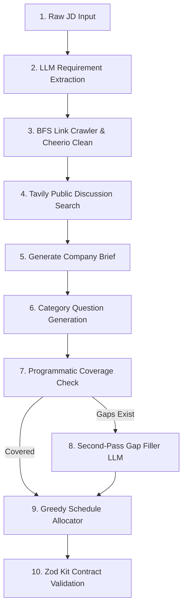

# Traq — AI Interview Prep Kit Generator

[](https://www.typescriptlang.org/)
[](https://nextjs.org/)
[](https://expressjs.com/)
[](https://www.mongodb.com/)
[](https://ai.google.dev/)

**Traq** is a full-stack, multi-agent AI system that generates structured, highly customized Interview Preparation Kits from Job Descriptions (JDs) and company URLs.

It crawls company career pages, searches public interview discussions, extracts non-hallucinated requirements, generates category-scoped question banks and flashcards, programmatically verifies 100% requirement coverage, builds a greedy study schedule, and provides an interactive builder UI with state-pinning and practice modes.

---

## 1. Stack Justification & Separation of Concerns

- **Frontend:** Next.js 14 (App Router) + TypeScript + Tailwind CSS. Provides Figma-level dark aesthetics with glassmorphism, responsive navigation, and optimistic UI updates.
- **Backend:** Standalone Node.js + Express + TypeScript service (deployed separately from frontend Next.js API routes).
  - *Architectural Rationale:* The specification requires retrieval, extraction, generation, scheduling, and persistence to be strictly separated concerns. A dedicated Express service enforces this separation structurally at the directory level (`src/modules/*`), avoiding coupling web rendering with long-running LLM queues or link crawling.
- **Database:** MongoDB Atlas (Mongoose) storing User accounts and Kit documents with content hashes for idempotency.
- **LLM Pipeline:** **Google Gemini (gemini-1.5-flash)** as primary provider with **Groq (Llama 3.1)** fallback. Gemini provides JSON-mode output, low latency, and a generous free tier.
- **Retrieval Layer:**
  - `cheerio` for HTML parsing and noise removal (scripts, styles, navs, footers).
  - Custom link-scoring BFS crawler (`depth <= 2`, `max 15 pages`) respecting `robots.txt` via `robots-parser`.
  - **Tavily API** for searching public interview process experiences on Glassdoor/Reddit/Blind without ToS violations or CAPTCHAs.

---

## 2. Quickstart & Local Setup

### Prerequisites
- Node.js >= 18.0.0
- npm >= 9.0.0

### Step 1: Clone & Install Dependencies
```bash
git clone <repo-url>
cd traq-assignment
npm install
```

### Step 2: Configure Environment Variables
Copy `.env.example` to `backend/.env` and update required keys:
```env
PORT=5000
NODE_ENV=development
MONGODB_URI=mongodb://localhost:27017/traq_interview_prep
JWT_SECRET=super_secret_jwt_key_12345
GEMINI_API_KEY=your_gemini_api_key_here
GROQ_API_KEY=your_groq_api_key_optional
TAVILY_API_KEY=your_tavily_api_key_here
FRONTEND_URL=http://localhost:3000
```

### Step 3: Run Development Servers
```bash
# Terminal 1: Run Backend Express Server (port 5000)
npm run dev:backend

# Terminal 2: Run Frontend Next.js Server (port 3000)
npm run dev:frontend
```
Open [http://localhost:3000](http://localhost:3000) in your browser.

---

## 3. Batch Evaluation CLI Contract (Appendix B)

The batch evaluation CLI runs directly from a clean clone without requiring a running HTTP backend or database connection:

```bash
npm run evaluate -- --input <cases.json> --output <kits.json>
```

### Input Format (`cases.json`):
```json
[
  {
    "id": "case-1",
    "jd": "Senior Software Engineer. Required: 5+ years React, Node.js, and System Design.",
    "company_url": "http://localhost:8099/",
    "days": 5
  }
]
```

### Output Format (`kits.json`):
```json
{
  "version": "1.0.0",
  "generated_at": "2026-09-22T16:40:00.000Z",
  "kits": [
    {
      "id": "case-1",
      "status": "ok",
      "kit": { /* Appendix A Contract JSON */ },
      "error": null
    }
  ]
}
```

---

## 4. Pipeline Sequencing & Architecture

The kit generation process operates in 9 staged, non-overlapping steps:



1. **Extract Requirements:** LLM call extracting explicitly present qualifications. Priority classified as `must` ONLY if wording is mandatory ("required", "minimum N years"). IDs assigned in code (`r1`, `r2`).
2. **Crawl Company Site:** BFS crawler scores links (`careers`, `jobs`, `hiring`, `engineering`) up to depth 2, max 15 pages. Enforces `robots.txt` and rate limits to 1 req/sec.
3. **Search Public Discussions:** Tavily API queries Glassdoor/Reddit/Blind insights for the company name.
4. **Generate Company Brief:** Grounded solely in crawled text. If `pages_used` is empty, states information could not be retrieved honestly.
5. **Category-Scoped Generation:** Independent LLM prompts for `technical`, `behavioural`, `system-design`, and `company-fit`.
6. **Programmatic Coverage Loop (Zero LLM):** Pure `checkCoverage` code function checks if every `must` requirement has >=1 linked question. Up to 3 passes fill any gaps.
7. **Generate Flashcards:** Revision flashcards derived from the question bank.
8. **Greedy Schedule Allocation (Zero LLM):** Pure algorithm front-loads `must` requirements and harder questions into available days while balancing total minutes.
9. **Kit Validation:** Zod validator checks enum bounds, integer minutes/difficulties, and ID reference integrity before saving.

---

## 5. Non-Destructive State Pinning (`_meta`)

To solve the state clobber problem during section regeneration:

### Metadata Tag:
```ts
_meta: {
  origin: "generated" | "user_added" | "user_edited",
  generation_batch: number
}
```

### Regeneration Merge Logic:
1. When a user clicks **Regenerate Category** (e.g. `technical`), the backend re-runs generation *only* for that category.
2. During merge:
   - Any question with `origin === "user_edited"` or `origin === "user_added"` is **strictly preserved**.
   - Only machine-generated questions (`origin === "generated"`) in that target category are replaced.
3. Pure coverage check and schedule recalculation re-run over the newly merged set.

---

## 6. Pure Greedy Schedule Algorithm

The model is **never** allowed to perform schedule arithmetic or day allocation.

1. Questions are sorted by:
   - `must` priority requirement link (descending)
   - Question difficulty (`3` > `2` > `1`)
2. Minutes per question: Difficulty 1 = 10 min, Difficulty 2 = 15 min, Difficulty 3 = 20 min.
3. Questions are greedily allocated into `days_available` day buckets balancing total daily minutes.
4. Enforces `schedule.days.length === days_available` exactly (1 to 60 days).

---

## 7. Edge Case Matrix

| Edge Case | Standardized Behavior |
|---|---|
| Invalid / 404 / Timeout URL | Crawler returns empty `pages_used`. Kit generates from JD alone. Brief states info could not be retrieved. |
| Two-Line Thin JD | Extracts only textually present requirements. Does not fabricate or pad missing items. |
| No Public Discussion Found | Process questions fall back to standard JD-grounded questions without inventing interview rounds. |
| Invalid LLM JSON | Retries once with strict JSON prompt. If persistent, fails gracefully without crashing pipeline. |
| Rate Limit (429) | Exponential backoff (max 3 retries) with concurrency queue (max 2 parallel requests). |
| 1-Day or 60-Day Schedule | Clamped cleanly. 1-day packs all must-haves into Day 1. 60-day distributes questions evenly across days. |

---

## 8. Practice Mode & Creative Feature

- **Interactive Practice Mode (`/dashboard/[id]/practice`):** Flashcard player supporting keyboard controls (`Space`/`Enter` to flip, `1`-`3` for confidence ratings).
- **Confidence-Weighted Resurfacing:** Sorts unpracticed cards and low-confidence cards first in future sessions.
- **Export Kit:** Print-friendly CSS and PDF output capabilities.

---

## 9. Walkthrough Video Script (3–4 Minutes)

```text
[0:00 - 0:30] Introduction & Setup
"Hi everyone, this is the demonstration of Traq — an AI Interview Preparation Kit generator. 
We built this using Next.js 14, a standalone Node/Express TypeScript backend, MongoDB, and Gemini 1.5 Flash.
Notice how our backend is a separate service enforcing strict separation of concerns between crawling, extraction, generation, coverage checking, and schedule allocation."

[0:30 - 1:15] Creating a Kit & Staged Pipeline
"Let's create a new kit. I'll paste a Job Description for a Senior React Engineer and enter our local test fixture URL. 
When I click Generate, watch our real-time progress monitor. 
First, requirement extraction runs — notice how it classifies priority strictly from text. 
Next, our BFS link crawler inspects career pages while respecting robots.txt. 
Then Tavily searches public discussions on Glassdoor and Reddit. 
Finally, our code-driven coverage check verifies 100% coverage, and our pure greedy algorithm builds a balanced 5-day schedule."

[1:15 - 2:15] The Builder & Non-Destructive Regeneration
"Here is the generated Kit detail page. We have Company Brief, Role & Requirements with priority badges, Question Bank grouped by category, Flashcards, and Schedule.
Now let's test our state pinning. I'll edit this technical question prompt manually. Notice how its origin tag becomes 'user_edited'. 
If I now click 'Regenerate Technical Category', the LLM generates fresh questions, but our merge engine detects our edited question and PRESERVES it intact while replacing only machine-generated ones!"

[2:15 - 3:00] Practice Mode & Batch Evaluation CLI
"Next, let's open Practice Mode. We can flip cards using the Space bar and rate our confidence from 1 to 3. 
Cards with lower confidence are automatically resurfaced first in our next study session.
Finally, we can run `npm run evaluate -- --input cases.json --output kits.json` directly from the terminal. 
It processes all test cases in batch mode, catches individual site errors gracefully, and outputs Appendix B compliant JSON."

[3:00 - 3:30] Conclusion & Defense
"In summary, Traq keeps AI restricted to generation while using pure TypeScript code for diffing, coverage verification, and schedule math. Thank you!"
```
